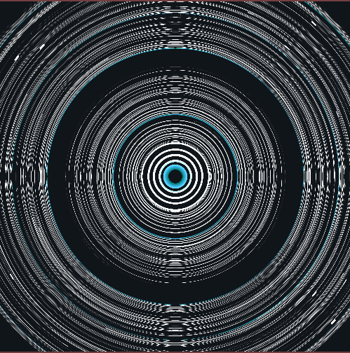

### Reason
So the reason behind making this sketch was to check whether velocity based time travel works as I expected it to. Now, I got a bit carried away and ended up making a fork of the sketch that generated vapor-wave like art which had, imo, a very cool and unique style.

### Results
The results are kind of mixed, which is rather unfortunate, as time travel did not work as I expected it to. This may mean that I would have to think about a better theory to apply. cool pics though:

[

[
